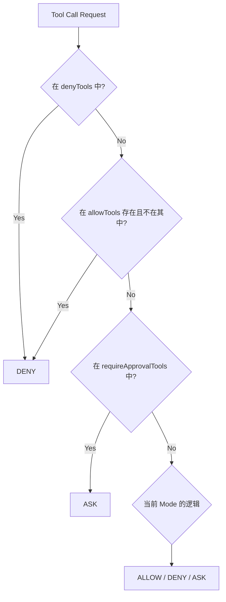

# 权限控制与敏感操作详解

在 AI Agent 运行过程中，安全性至关重要。`kode-sdk` 提供了一套完善的**权限控制系统**（Permission System），用于管理 Agent 对工具（Tool）的访问权限。

## 1. 核心概念：Permission Decision

每次 Agent 想要执行一个工具（如 `fs_write` 或 `bash_run`），SDK 都会进行一次权限评估，并产生三种可能的结果（Decision）：

| 结果 (Decision) | 含义 | 行为 |
| :--- | :--- | :--- |
| **allow** | 允许 | 工具立即执行，无需人工干预。 |
| **deny** | 拒绝 | 工具被拦截，返回错误信息（"Tool denied by policy"），Agent 需要另想办法。 |
| **ask** | **询问/审批** | Agent 暂停运行（PAUSED），进入“等待审批”状态，直到收到外部（用户或上层系统）的批准或拒绝。 |

## 2. 权限模式 (Permission Modes)

你可以在 `AgentTemplate` 或 `AgentConfig` 中配置 `permission.mode`，来决定 Agent 的整体行为风格。SDK 内置了三种模式：

### 2.1 `auto` (默认)
*   **策略**：全自动模式。
*   **逻辑**：除非显式配置了黑名单或强制审批，否则所有工具默认 **allow**。
*   **适用场景**：开发调试、信任度高的内部任务、只读任务。

### 2.2 `approval`
*   **策略**：全审批模式。
*   **逻辑**：所有工具调用默认返回 **ask**。
*   **适用场景**：高风险环境、新手引导、需要人工步步确认的场景。

### 2.3 `readonly`
*   **策略**：只读模式。
*   **逻辑**：
    *   如果工具元数据 (`metadata`) 标记为 `mutates: false` 或 `readonly: true`（如 `fs_read`），则 **allow**。
    *   如果工具会修改状态（如 `fs_write`），则 **deny**。
    *   如果无法确定，则 **ask**。
*   **适用场景**：代码审查 Agent、日志分析 Agent。

## 3. 细粒度控制 (Fine-grained Control)

除了整体模式，你还可以通过 `PermissionConfig` 对特定工具进行微调。这些配置的优先级**高于**整体模式。

```typescript
interface PermissionConfig {
  mode: 'auto' | 'approval' | 'readonly';
  
  // 1. 显式拒绝 (最高优先级)
  denyTools?: string[];        
  
  // 2. 显式白名单 (如果在白名单外则拒绝)
  allowTools?: string[];       
  
  // 3. 强制审批 (遇到这些工具必须问)
  requireApprovalTools?: string[]; 
}
```

### 评估流程图



## 4. 什么是“敏感权限”？

在 `kode-sdk` 中，“敏感权限”通常指代那些**会产生副作用**（Side Effects）或**潜在风险**的工具操作。

虽然 SDK 没有硬编码一个“敏感列表”，但通常以下工具被视为敏感工具，建议在生产环境中配置为 `requireApprovalTools`：

1.  **文件写操作**：`fs_write`, `fs_edit`, `fs_delete`
    *   风险：覆盖重要代码、删除数据。
2.  **Shell 命令**：`bash_run`
    *   风险：执行任意系统命令，虽然有沙箱，但仍具风险。
3.  **网络操作**：`http_request` (如果存在)
    *   风险：数据外泄、内网扫描。

### 示例配置：安全开发模式

```typescript
const secureDevConfig = {
  permission: {
    mode: 'auto', // 大部分工具自动放行
    requireApprovalTools: [
      'bash_run',  // 运行命令必须审批
      'fs_write'   // 创建新文件必须审批
    ],
    denyTools: [
      'fs_delete'  // 禁止删除文件
    ]
  }
};
```

## 5. 授权询问 (Approval Workflow)

当评估结果为 `ask` 时，会触发授权询问流程：

1.  **状态变更**：Agent 状态变为 `PAUSED`，并在工具记录中标记 `state: 'APPROVAL_REQUIRED'`。
2.  **事件通知**：SDK 发出 `permission_required` 事件（通过 `agent.on('permission_required', ...)` 监听）。
3.  **等待响应**：Agent 挂起，等待外部调用 `agent.decide(id, 'allow' | 'deny')`。

### 代码交互示例

**用户端（前端/控制台）：**

```typescript
// 监听审批请求
agent.on('permission_required', async (event) => {
  const { call } = event;
  console.log(`Agent 请求调用工具: ${call.name}`);
  console.log(`参数:`, call.inputPreview);
  
  // 模拟用户交互
  const userDecision = await promptUser("是否允许？(y/n)");
  
  // 回复 Agent
  if (userDecision === 'y') {
    await event.respond('allow'); // 继续执行
  } else {
    await event.respond('deny', { note: '用户觉得操作太危险' }); // 拒绝执行
  }
});
```

**Agent 内部行为：**

*   **如果 Allow**：Agent 恢复为 `WORKING`，开始执行工具代码。
*   **如果 Deny**：Agent 恢复为 `WORKING`，但跳过工具执行，直接向 LLM 返回一个 `ToolResult`，内容是错误信息（例如 "User denied this operation"）。LLM 收到后通常会道歉或尝试其他方案。
