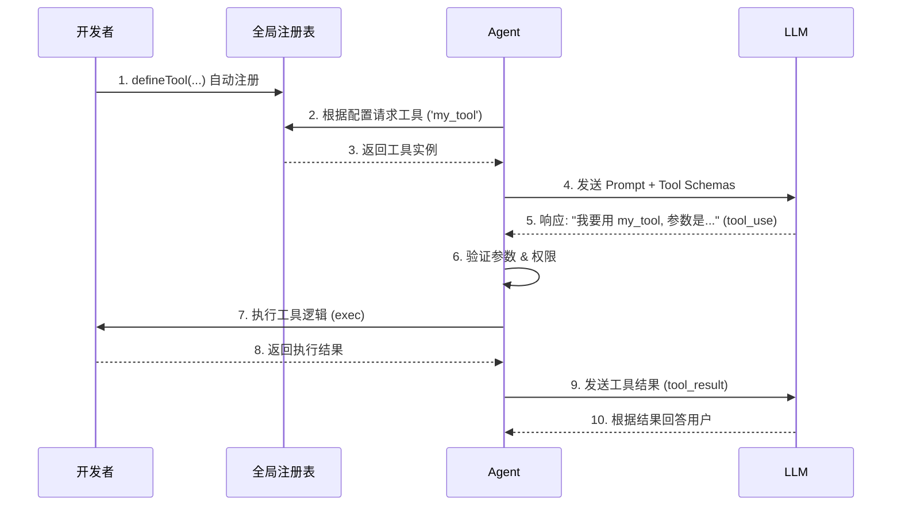

# Tool 注册、发现与调用机制详解

本文档详细解释了 `kode-sdk` 中 Tool 从定义到被 Agent 调用的完整生命周期。

## 1. 什么是“便捷注册”？

在 `kode-sdk` 中，“便捷注册”主要指的是**定义即注册**的设计理念和 `defineTool` 这个简化 API。

### 1.1 自动注册机制
你不需要手动编写代码去“挂载”或“安装”一个工具。只要你的工具定义文件被代码加载（即被 `import`），它就会自动生效。

*   **原理**：`tool()` 和 `defineTool()` 函数内部不仅创建了工具对象，还执行了 `globalToolRegistry.register(name, factory)`。
*   **好处**：开发新工具时，只需关注业务逻辑，无需修改 Agent 的核心配置代码。

### 1.2 简化 API (`defineTool`)
为了进一步降低门槛，SDK 提供了 `defineTool` (位于 `src/tools/define.ts`)。

*   **无需 Zod**：你可以直接用简单的 JSON 对象定义参数类型（如 `{ type: 'string' }`），SDK 会自动将其转换为规范的 JSON Schema。
*   **无需手动处理 Context**：常用的功能（如发射事件）被封装在增强的上下文 (`EnhancedToolContext`) 中。

## 2. Agent 如何“知道”有哪些 Tool？ (发现机制)

Agent 在启动时，通过以下步骤加载工具：

### 2.1 配置阶段
在 `AgentConfig` 或 `AgentTemplate` 中，有一个 `tools` 字段。这通常是一个字符串数组，列出了该 Agent **被允许使用**的工具名称。

```typescript
// 示例配置
const config = {
  templateId: 'default',
  tools: ['fs_read', 'fs_write', 'my_custom_tool'] // 指定可用工具
};
```

### 2.2 解析阶段 (`resolveTools`)
当 `Agent.create(config)` 被调用时：

1.  Agent 读取配置中的 `tools` 列表。
2.  它去全局注册表 (`ToolRegistry`) 中根据名称查找对应的**工具工厂函数**。
3.  找到后，立即调用工厂函数，实例化这些工具 (`ToolInstance`)。
4.  这些实例被保存在 Agent 内部的 `this.tools` Map 中。

### 2.3 告知 LLM
在每一轮对话（`runStep`）开始时：

1.  Agent 调用 `this.getToolSchemas()`，遍历所有已加载的工具。
2.  提取每个工具的 `name`, `description`, 和 `input_schema`。
3.  将这些信息打包，通过 `model.stream({ tools: ... })` 发送给 LLM（如 Claude 或 GPT）。
4.  **结果**：LLM “看到”了工具的说明书，知道有哪些工具可用，以及该如何调用它们。

## 3. Tool 是如何被调用的？ (执行流程)

当 LLM 决定使用工具时，整个流程如下：

### 3.1 LLM 发起调用
LLM 不会直接执行代码，它只是返回一个特定格式的 JSON 数据，表示“我想调用工具 X，参数是 Y”。

*   **响应格式**：`{ type: 'tool_use', name: 'fs_read', input: { path: '...' } }`

### 3.2 Agent 解析与验证
Agent 接收到 LLM 的响应后：

1.  **查找工具**：根据 `name` 在 `this.tools` 中查找对应的工具实例。如果没找到，返回 `Tool not found` 错误。
2.  **参数验证**：使用 AJV 库，根据工具定义的 Schema 校验 LLM 生成的 `input` 参数是否合法。
3.  **权限检查**：检查 Agent 的权限配置 (`PermissionConfig`)，确认是否允许执行该工具。

### 3.3 执行与结果 (`processToolCall`)
如果一切检查通过：

1.  **注入上下文**：Agent 创建 `ToolContext`，注入沙箱 (`sandbox`)、文件池 (`filePool`)、用户认证信息 (`userToken`) 等。
2.  **执行逻辑**：调用工具定义的 `exec` 函数。
3.  **捕获结果**：
    *   **成功**：获取返回值，标记为 `ok: true`。
    *   **失败**：捕获异常，标记为 `ok: false`，并提供错误信息。

### 3.4 回传给 LLM
1.  Agent 将工具的执行结果封装为 `tool_result` 类型的消息。
2.  这个消息被追加到对话历史中 (`messages` 数组)。
3.  **再次调用 LLM**：Agent 发起新一轮的 `model.stream`。这次 LLM 看到了之前的工具调用请求**和**对应的执行结果，从而根据结果生成最终的自然语言回复。

---

## 总结图解


