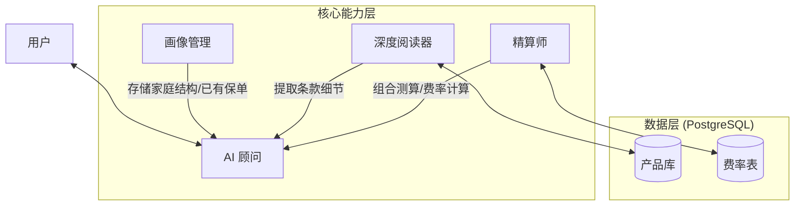

# 高级 AI 保险顾问架构设计

本方案针对**深度咨询**场景设计，支持家庭保障规划、现有保单分析、条款深度解读及风险缺口分析。

## 一、系统架构图



## 二、核心工具定义 (Tool Definitions)

### 1. 🔍 知识检索类 (Knowledge)

#### Tool: `insurance_search_text` (全文检索)
**能力**：在数据库的所有文本字段中搜索关键词。
**场景**：用户问“有没有保跳伞的保险？”或者“不管身故只管残疾的有没有？”
**参数**：
```typescript
{
  keyword: string;          // 搜索词，如 "高风险运动", "牙科", "猝死"
  search_scope?: string[];  // 范围，如 ["coverage", "exclusions", "description"]
  limit?: number;           // 返回数量
}
```
**底层逻辑**：使用 PostgreSQL 的全文检索 (Full-Text Search) 或 `LIKE` 模糊查询，扫描 `insurance_product` 表的相关字段。

#### Tool: `insurance_inspect_details` (显微镜)
**能力**：**精准读取**指定产品的指定字段内容。这是实现“选择性读取”的核心。
**场景**：AI 想要对比两个产品的“责任免除”条款，或者查看某个产品的“犹豫期”规定。
**参数**：
```typescript
{
  product_ids: number[];    // 支持同时查多个产品
  fields: string[];         // 指定要读的字段
  // 例如：["coverage", "exclusions", "surrender_terms", "extend_info.waiting_period"]
}
```
**亮点**：支持 `extend_info` JSON 字段的深层路径读取，让 AI 能读到数据库里最细微的配置。

#### Tool: `insurance_compare_specs` (对比器)
**能力**：生成结构化的对比数据。
**参数**：
```typescript
{
  product_ids: number[];
  dimensions: ["price", "age_limit", "waiting_period", "coverage_highlights"];
}
```

---

### 2. 👤 用户画像类 (Profiling)

为了实现“组合推荐”和“家庭配置”，AI 必须记住所服务对象的信息。

#### Tool: `profile_manage_family` (家庭档案)
**能力**：添加或更新家庭成员信息。
**参数**：
```typescript
{
  action: "add" | "update" | "remove";
  member: {
    relation: "self" | "spouse" | "child" | "parent"; // 关系
    age: number;
    gender: "M" | "F";
    occupation?: string;      // 职业（评估风险用）
    health_status?: string;   // 健康告知
    existing_policies?: string[]; // 已有保险描述
  }
}
```
**作用**：让 AI 记住“家里有个3岁男孩，还没买重疾险；爸爸是货车司机，有社保”。

#### Tool: `profile_analyze_gap` (缺口分析)
**能力**：基于家庭档案，分析风险缺口。
**参数**：
```typescript
{
  target_members: string[]; // 分析谁？["self", "spouse"]
}
```
**返回示例**：
```json
{
  "spouse": {
    "risk_profile": "家庭经济支柱，职业风险中等",
    "existing_coverage": ["意外险"],
    "missing_coverage": ["定期寿险(防止身故导致家庭收入中断)", "重疾险(防范大病风险)"],
    "priority": "High"
  }
}
```

---

### 3. 🧮 方案规划类 (Solution)

#### Tool: `proposal_calculate_portfolio` (组合测算)
**能力**：一次性计算家庭多人的保费总额。
**场景**：给爸爸配重疾+寿险，给孩子配医疗险，算总账。
**参数**：
```typescript
{
  items: [
    { member_relation: "self", product_id: 10, amount: 500000, term: 20 },
    { member_relation: "child", product_id: 6, plan: "PlanA" }
  ]
}
```
**返回**：
- 每个人的一年保费
- 家庭总保费
- 缴费压力评估（占家庭收入比例，如果有收入数据）

---

## 三、场景演练：从“问询”到“成单”

### 场景：三口之家配置方案

**用户**：“我想给全家买保险，预算2万左右。我有老婆和一个5岁的女儿。”

#### Step 1: 建立档案 (Ask & Record)
AI (思考): 用户提到了家庭成员，先记录下来。
**Tool Call**: `profile_manage_family`
```json
{
  "action": "add",
  "members": [
    { "relation": "self", "gender": "M" },
    { "relation": "spouse", "gender": "F" },
    { "relation": "child", "age": 5, "gender": "F" }
  ]
}
```
AI：“好的，为了更准确推荐，请问您和太太今年多大？从事什么工作？之前买过商业保险吗？”

**用户**：“我30岁程序员，老婆28岁会计。都没买过。”

#### Step 2: 风险分析 (Gap Analysis)
AI (思考): 典型的双职工家庭，孩子还小。如果不幸发生，房贷和抚养压力大。
**Tool Call**: `profile_analyze_gap`
**Result**: 建议爸爸妈妈配置【重疾+定寿+医疗】，孩子配置【意外+医疗+重疾】。

#### Step 3: 选品与对比 (Selection & Inspect)
AI (思考): 爸爸是程序员，工作强度大，要注意猝死保障。搜索一下含“猝死”的产品。
**Tool Call**: `insurance_search_text` { "keyword": "猝死", "product_type": "意外险" }
**Result**: 找到了 "友邦乐运动意外伤害保险"。

AI (思考): 再给孩子选个医疗险，对比一下“友邦优享康惠”和“友邦深圳专属团体”。
**Tool Call**: `insurance_inspect_details`
```json
{
  "product_ids": [9, 19],
  "fields": ["coverage", "waiting_period", "exclusions"]
}
```
**Result**: AI 发现产品 19 的免责条款里对既往症限制更严，决定推荐产品 9。

#### Step 4: 组合报价 (Portfolio Calculation)
AI (思考): 选好了，爸爸买产品A+B，妈妈买A，孩子买C。算算总价有没有超2万预算。
**Tool Call**: `proposal_calculate_portfolio`
```json
{
  "items": [
    { "member_relation": "self", "product_id": 12, "amount": 300000 },
    { "member_relation": "spouse", "product_id": 12, "amount": 300000 },
    { "member_relation": "child", "product_id": 9 }
  ]
}
```
**Result**: 总保费 1.8 万。

#### Step 5: 最终输出
AI：“为您规划了全家保障方案，总保费 1.8 万元，符合预算：
1.  **爸爸（家庭支柱）**：配置了30万重疾险，包含猝死责任（考虑到您经常加班）。
2.  **妈妈**：同样配置30万重疾。
3.  **女儿**：配置了高端医疗险，感冒发烧去私立医院也能报。
这个方案的优势在于……”

---

## 四、技术实现细节

### 1. 数据库 `extend_info` 的利用
在 PostgreSQL 中，`extend_info` 是 JSONB 类型。
`insurance_inspect_details` 工具在 SQL 查询时，可以使用 `->>` 操作符直接读取 JSON 内部字段：
```sql
-- 示例：只读取 extend_info 里的 "waiting_period_detail" 字段
SELECT extend_info->>'waiting_period_detail' FROM insurance_product WHERE id = 1;
```
这让 AI 能够挖掘出结构化字段之外的隐藏信息。

### 2. 长文本处理
对于 `coverage` 和 `exclusions` 这种长文本，如果内容太长（超过 2000 token），工具应该先返回摘要，或者支持 `search_in_product`（在特定产品内搜关键词），避免 Context 溢出。
