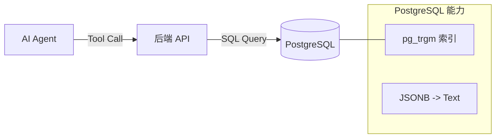

# AI 保险顾问：高级检索工具集实现文档

## 1. 核心目标
为了让 AI 能够更精准、高效地检索和对比保险产品信息，我们从“纯文本搜索”升级到了“结构化 + 语义化”的分层检索体系。这一设计旨在解决以下痛点：
*   **上下文限制**：避免一次性加载数万字的条款全文。
*   **深层信息挖掘**：支持搜索隐藏在 JSON (`extend_info`) 中的业务规则（如“犹豫期”、“免责条款”）。
*   **精准数值筛选**：支持按年龄、保费等数值条件过滤产品。

## 2. 系统架构


## 3. 三大核心工具 (Tools)

### 3.1 🔍 增强型搜索 (`/api/tools/search`)
**定位**：粗排与召回。当 AI 不知道具体要找哪个产品，或者在寻找包含特定权益的产品时使用。

*   **能力**：
    *   **全文覆盖**：同时搜索 `product_name` (名称)、`description` (简介) 和 `extend_info` (JSON 扩展字段)。
    *   **智能摘要**：仅返回命中关键词前后 100 个字符的片段 (`snippet`)，而非全文。
    *   **相关度排序**：名称匹配 > 简介匹配 > JSON 匹配。

*   **SQL 实现逻辑**：
    ```sql
    -- 核心：将 JSON 转为文本进行模糊匹配
    WHERE extend_info::text ILIKE '%关键词%'
    ```

*   **Agent 使用场景**：
    > 用户：“有没有保猝死的保险？”
    > Agent: `call search(keyword="猝死")`

### 3.2 🔬 精准查阅 (`/api/tools/inspect`)
**定位**：精读与细节确认。当 AI 已经锁定了产品 ID，需要查询特定条款细节时使用。

*   **能力**：
    *   **按需读取**：只返回 AI 请求的字段，极大节省 Token。
    *   **JSON 穿透**：支持使用点号语法 (`.`) 直接读取 JSON 内部字段。

*   **接口示例**：
    *   请求：`product_id=1`, `fields="product_name,extend_info.waiting_period"`
    *   返回：`{"product_name": "...", "extend_info.waiting_period": "90天"}`

*   **Agent 使用场景**：
    > 用户：“友邦这个产品的犹豫期是几天？”
    > Agent: `call inspect(product_id=10, fields=["extend_info.cooling_off_period"])`

### 3.3 ⚖️ 智能过滤 (`/api/tools/filter`)
**定位**：硬指标筛选。处理数值、枚举等结构化数据的筛选。

*   **能力**：
    *   **数值范围**：支持年龄 (`age_min`, `age_max`) 等数值比较。
    *   **类型筛选**：支持险种类型 (`product_type`) 筛选。

*   **Agent 使用场景**：
    > 用户：“给我找适合 60 岁以上老人的保险。”
    > Agent: `call filter(age_min=60)`

## 4. 数据库配置
为了支持上述功能，数据库层面做了以下优化：

1.  **开启扩展**：
    ```sql
    CREATE EXTENSION IF NOT EXISTS pg_trgm;
    ```
2.  **创建索引** (针对模糊搜索优化)：
    ```sql
    -- JSON 字段转文本索引，加速深层搜索
    CREATE INDEX idx_extend_info_trgm ON insurance_product USING GIN ((extend_info::text) gin_trgm_ops);
    -- 简介字段索引
    CREATE INDEX idx_desc_trgm ON insurance_product USING GIN (description gin_trgm_ops);
    ```

## 5. 验证与测试
已提供测试脚本 `backend/test_tools.sh`，可直接运行验证 API 的可用性：
```bash
cd backend
./test_tools.sh
```

## 6. 下一步建议
1.  **更新 Agent 定义**：在前端/SDK 层更新 Tool Definition，对接这三个新 API。
2.  **Prompt 优化**：在 System Prompt 中教 Agent 何时使用 Filter（有明确数字限制时），何时使用 Search（模糊查找时），以及利用 Inspect 节省上下文。
