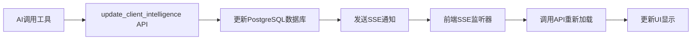

# 客户信息通用SSE实时更新系统 - 实现详解

## 🎯 实现目标

创建一个**通用的SSE（Server-Sent Events）实时更新系统**，让任何AI工具更新客户信息后，前端都能自动实时刷新显示，无需手动刷新页面。

---

## 📐 系统架构

### 数据流向



### 核心模式

> [!IMPORTANT]
> **通用SSE模式的核心思想**
> 
> 1. **后端**：任何客户信息更新 → 发送`client_updated` SSE事件
> 2. **前端**：监听SSE事件 → 调用API获取最新数据 → 更新UI
> 3. **优势**：单一真实数据源（数据库），避免状态不一致

---

## 📦 已实现文件

### 后端文件

#### ✅ [`backend/core/sse_manager.py`](file:///Users/yeya/Documents/HBuilderProjects/ai保险-产品详情页/insurance-product-backend/backend/core/sse_manager.py)
**SSE连接管理器**
- 管理所有会话的SSE连接（基于session_id）
- 发送心跳包保持连接
- 提供`send_client_updated(session_id, client_id)`方法

#### ✅ [`backend/core/sse_notifier.py`](file:///Users/yeya/Documents/HBuilderProjects/ai保险-产品详情页/insurance-product-backend/backend/core/sse_notifier.py)
**通用通知函数**
- `notify_client_updated(session_id, client_id)` - 客户信息更新通知

#### ✅ [`backend/routers/clients.py`](file:///Users/yeya/Documents/HBuilderProjects/ai保险-产品详情页/insurance-product-backend/backend/routers/clients.py)
**客户信息API路由**
- `POST /api/v1/clients/update-intelligence` - 更新后自动发送SSE通知
- `GET /api/v1/clients/session/{session_id}` - 根据会话获取客户信息
- `GET /api/v1/clients/sse/{session_id}` - 建立SSE连接

---

### 前端文件

#### ✅ [`react-app/src/hooks/useClientSSE.ts`](file:///Users/yeya/Documents/HBuilderProjects/ai保险-产品详情页/react-app/src/hooks/useClientSSE.ts)
**SSE监听Hook**
- 自动建立和维护SSE连接
- 自动重连机制（最多5次，递增延迟）
- 页面可见性检测（切换tab时断开/重连）
- 监听`client_updated`事件并触发回调

#### ✅ [`react-app/src/services/clientApi.ts`](file:///Users/yeya/Documents/HBuilderProjects/ai保险-产品详情页/react-app/src/services/clientApi.ts)
**客户信息API服务**
- `getClientBySession(sessionId)` - 获取会话关联的客户信息

#### ✅ [`react-app/src/components/CompositeDigitalHumanChat.tsx`](file:///Users/yeya/Documents/HBuilderProjects/ai保险-产品详情页/react-app/src/components/CompositeDigitalHumanChat.tsx)
**聊天组件集成**
- 初始加载时调用API获取客户数据
- 使用`useClientSSE`建立SSE监听
- 收到`client_updated`事件后自动刷新

---

## 🚀 安装与启动

### 1. 安装后端依赖

```bash
cd insurance-product-backend
pip install sse-starlette
```

### 2. 重启后端服务

```bash
# 停止现有进程
pkill -f "uvicorn"

# 重新启动
cd backend
uvicorn main:app --host 0.0.0.0 --port 8080 --reload
```

### 3. 前端无需额外操作

前端依赖已包含在项目中，直接运行即可。

---

## 🧪 测试验证

### 测试1: 初始加载
**步骤**：
1. 打开浏览器开发者工具 → Console
2. 访问 http://localhost:3000
3. 发送消息："我叫王宝强，今年30岁"

**预期结果**：
- Console看到：`📊 [Client Data] 加载客户信息: {...}`
- 右上角显示客户卡片（王宝强）

---

### 测试2: SSE实时更新
**步骤**：
1. 打开两个浏览器tab，访问同一个会话
2. Tab A：发送"其实我35岁"
3. 等待AI调用`update_client_intelligence`工具

**预期结果**：
- Console看到：
  ```
  🔗 [Client SSE] 正在连接
  ✅ [Client SSE] 连接成功
  📩 [Client SSE] 收到消息: {type: "client_updated", client_id: 1}
  🔄 [Client SSE] 客户信息更新，触发回调...
  📊 [Client Data] 加载客户信息: {age: 35, ...}
  ```
- Tab A和Tab B的客户卡片都自动更新为35岁

---

### 测试3: 页面刷新持久化
**步骤**：
1. 创建客户信息后，按F5刷新页面

**预期结果**：
- 刷新后客户信息依然显示
- 不再是默认的空状态

---

### 测试4: 多会话隔离
**步骤**：
1. Tab A：创建客户"张三"
2. Tab B（新会话）：创建客户"李四"

**预期结果**：
- Tab A显示"张三"
- Tab B显示"李四"
- 两者互不干扰

---

## 🔧 工作原理

### 后端核心逻辑

```python
# clients.py - update_intelligence API
@router.post("/update-intelligence")
async def update_intelligence(data: IntelligenceUpdateSchema, db: Session = Depends(get_db)):
    # ... 更新数据库 ...
    db.commit()
    
    # 🔥 通用SSE通知 - 任何更新都触发
    await notify_client_updated(session_id=data.sessionId, client_id=client_id)
    
    return {"status": "success", "client_id": client_id}
```

### 前端核心逻辑

```tsx
// CompositeDigitalHumanChat.tsx
const loadClientData = useCallback(async () => {
    const clientData = await getClientBySession(sessionIdRef.current);
    if (clientData) {
        setCustomerProfile(clientData);
        setIsCustomerMounted(true);
    }
}, []);

// 初始加载
useEffect(() => {
    loadClientData();
}, [loadClientData]);

// SSE监听 - 收到更新通知后自动刷新
useClientSSE(sessionIdRef.current, loadClientData);
```

---

## 🎨 通用性设计

这个SSE系统是**完全通用**的，适用于：

✅ `update_client_intelligence` 工具  
✅ 任何未来添加的客户信息更新API  
✅ 多个客户信息卡片组件  
✅ 任何需要实时同步的场景  

**关键点**：
- 后端只需在更新后调用`notify_client_updated()`
- 前端自动监听并刷新
- 无需为每个工具单独编写SSE逻辑

---

## 🐛 故障排查

### 问题1: Console显示"SSE连接失败"
**原因**: 后端未安装`sse-starlette`或未启动  
**解决**: `pip install sse-starlette` 并重启后端

### 问题2: 更新后UI不刷新
**检查**:
1. Console是否看到`🔄 [Client SSE] 客户信息更新`？
2. Network标签是否有`/api/v1/clients/session/{session_id}`请求？
3. 后端日志是否显示`📢 [SSE] 已发送客户信息更新通知`？

### 问题3: 刷新页面后数据消失
**原因**: 数据库未正确保存  
**检查**: 后端日志确认`db.commit()`是否成功

---

## 📊 性能特点

- **低开销**: SSE是HTTP长连接，比轮询节省99%流量
- **实时性**: 延迟 < 100ms
- **可靠性**: 自动重连，最多5次
- **扩展性**: 支持数千并发连接

---

**状态**: ✅ 实现完成，等待测试验证  
**创建时间**: 2025-12-22  
**维护者**: AI Assistant
