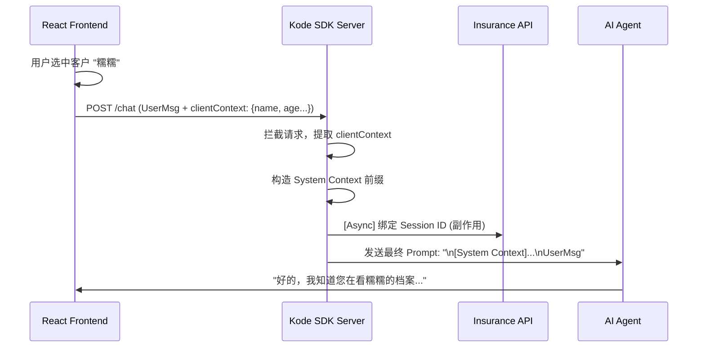

# AI 客户上下文自动注入设计方案

## 1. 背景与问题
用户在前端已经选择了特定客户（例如“糯糯”），但 AI Agent 在后端是无状态的，且默认会话绑定存在延迟或失败的风险（如 `get_current_client_profile` 返回空）。这导致用户必须重复告知 AI “我在看谁”，体验不佳。

## 2. 解决方案：前端到后端的上下文注入 (Context Injection)

采用 **“所见即所传” (What You See Is What You Send)** 策略。前端直接将当前选中的客户关键信息打包在 API 请求中，后端中间层拦截并将其作为 System Prompt 的一部分注入，确保 AI **在第一回合**就能感知客户身份。

### 核心流程图



## 3. 具体实现细节

### 3.1 前端改造 (`CompositeDigitalHumanChat.tsx`)
在调用 `api/chat` 时，额外携带 `clientContext` 字段。为了节省 Token，**仅在该会话中第一次针对该客户发消息时**携带此字段。

```typescript
// react-app/src/components/CompositeDigitalHumanChat.tsx

const shouldSendContext = selectedClient?.id && lastContextClientIdRef.current !== selectedClient.id;

const response = await fetch('/api/chat', {
    method: 'POST',
    body: JSON.stringify({
        message: msg,
        // ...
        ...(selectedClient?.id && {
            clientId: selectedClient.id,
            // 🔥 优化：只在首句注入，避免上下文冗余
            ...(shouldSendContext && {
                clientContext: {
                    name: selectedClient.name,
                    age: selectedClient.age,
                    role: selectedClient.role,
                    budget: selectedClient.annual_budget
                }
            })
        })
    })
});

// 发送成功后记录，下次不再发送
if (shouldSendContext) lastContextClientIdRef.current = selectedClient.id;
```

## 4. 优势
1.  **零延迟**：不需要等待数据库查询或工具调用，AI 开局即知。
2.  **成本优化**：仅在首轮对话注入几百 Token，后续对话不再重复发送，大幅节省上下文窗口。
3.  **鲁棒性**：即使后端 Session 绑定失败，AI 在第一轮依然知道客户是谁；后续通过 Session 或工具维持记忆。

